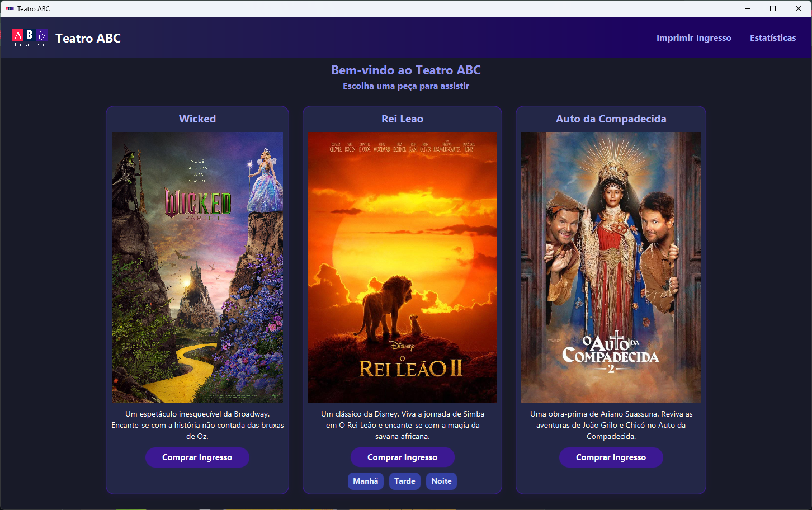
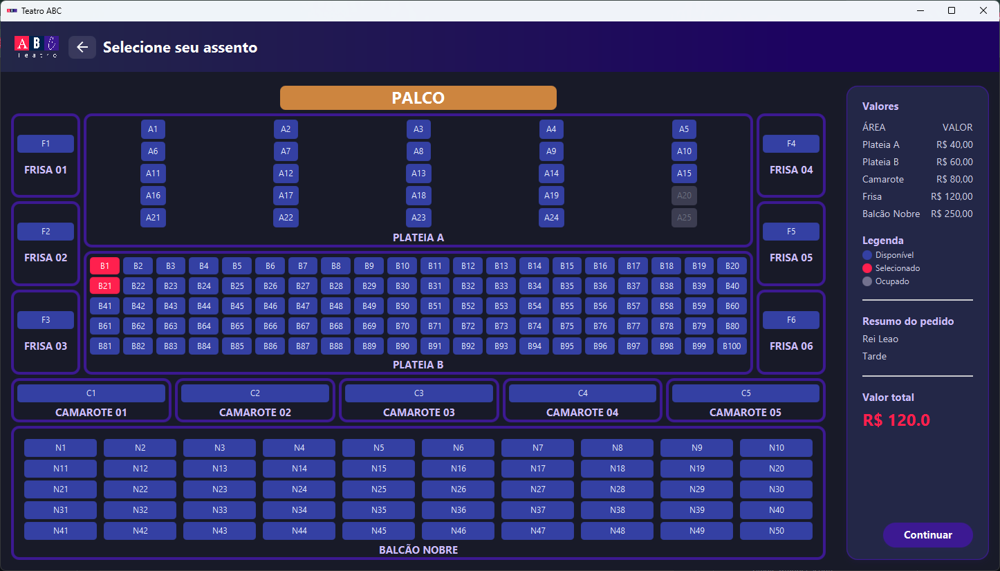
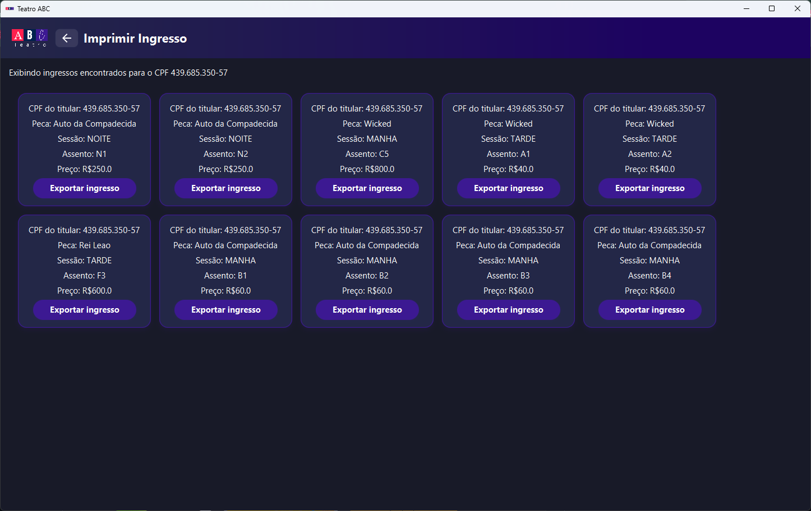
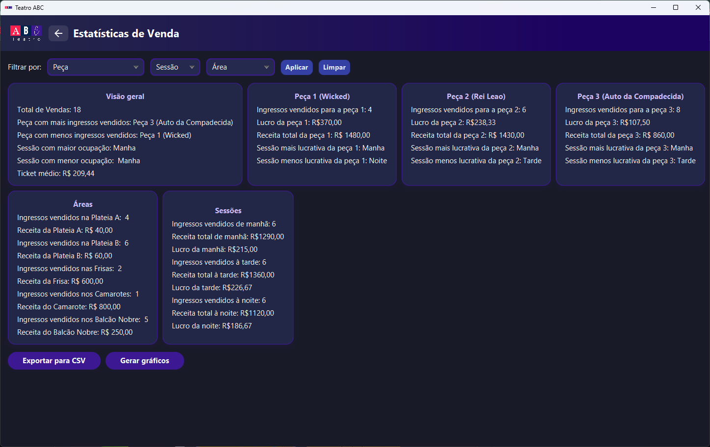

# Theater booking system

Este projeto permite que usuários comprem ingressos para 3 peças em um teatro, imprimam esses ingressos e gerem estatísticas baseadas nas vendas.


## Funcionalidades

- **Comprar Ingressos**: Usuários podem escolher entre três peças (Wicked, O Rei Leão e Auto da Compadecida, por padrão), disponíveis em três turnos, e reservar assentos.
- **Escolher diferentes áreas**: O teatro possui cinco áreas distintas (Plateia A, Plateia B, Frisa, Camarote e Balcâo Nobre), cada uma com preços e disponibilidade de assentos diferentes para o usuário escolher.
- **Imprimir ingresso**: Usuários podem informar seu CPF e visualizar todos os ingressos que compraram.
- **Mostrar estatísticas**: O sistema fornece estatísticas gerais de vendas do teatro, além de estatísticas individuais para cada peça, área e sessão, podendo escolher filtros para uma visualização mais específica.
- **Exportar dados**: Usuários podem facilmente exportar tanto os ingressos comprados quanto as estatísticas de vendas do teatro para um arquivo `.csv`.

## Screenshots









## Instalação

### Pré-requisitos

- Java 23 or newer installed.

### Como instalar
#### Pelo Git CLI
1. Certifique-se de que o Git está instalado.
2. Vá até o diretório onde deseja que a pasta do projeto seja criada.
3. Clone o repositório:
```bash
  git clone https://github.com/muriloonunes/theater-booking-system.git
```
4. Abra o projeto na sua IDE favorita.

## Feito com

- **Java**: Linguagem de programação robusta e orientada a objetos.
- **JavaFX**: Framework para construir interfaces gráficas modernas e responsivas.
- **SceneBuilder**: Ferramenta visual para criar e organizar interfaces JavaFX.

## Autores

- **Murilo Nunes** [muriloonunes](https://github.com/muriloonunes/)
- **Hartur Sales** [hartur-sales](https://github.com/hartur-sales)
- **Davy Lopes** [DavyL0](https://github.com/DavyL0)

## Licença

Este projeto está licenciado sob a **GNU General Public License v3.0**.
